# Automated Registration of High-Resolution Satellite Imagery Using Height-Aware Global Modeling and Reliability-Controlled Local Refinement

**Juyoung Kim**<sup>1</sup>, **Hyun-Ok Kim**<sup>2</sup>, **Han Oh**<sup>1,2</sup>

<sup>1</sup>University of Science and Technology (UST), Daejeon, Republic of Korea

<sup>2</sup>Korea Aerospace Research Institute (KARI), Daejeon, Republic of Korea

---

This repository is a gallery of selected registration examples accompanying our manuscript on automated orthorectification of high-resolution satellite imagery. The examples illustrate the registered outputs across different landscapes and imaging conditions; the quantitative results summarized below come from the full validation experiment reported in the manuscript. The method estimates the ground-to-image relation directly from dense correspondences and a DEM: a robustly fitted global model combines a third-order planimetric polynomial with a linear height basis, and a local stage applies reliability-controlled position-wise corrections that are adaptively smoothed. Both components form a single coordinate field applied to the original image with one resampling.

## Results Reported in the Manuscript

- **150 NEONSAT-1** pansharpened L1R scenes over South Korea and adjacent waters (Feb 19 – Aug 27, 2025; 24 acquisition events)
- **130 validation scenes / 27,594 check points**: scene-mean RMSE of **1.63 m** vs. **3.78 m** for RPC-based homography compensation using the same correspondences; per-scene RMSE stayed **below 5 m in every validation scene**
- **Height basis** reduced the planimetric-model error from **6.56 m to 2.20 m**
- The proposed method gave the **lowest scene-mean RMSE among all compared models** for each of four correspondence extractors (SIFT 2.49 m, DISK+LightGlue 1.89 m, LoFTR 1.70 m, RoMa v2 1.63 m)

Parameters were fixed using **20 development scenes** and evaluated on **130 validation scenes**, with the split made by acquisition event. Reported errors measure registration accuracy **relative to the reference imagery**, not absolute geolocation accuracy. Scene-mean RMSE is the arithmetic mean of the per-scene RMSE values.

## Registration Examples

Each close-up GIF alternates between the **reference image** and the **registered NEONSAT-1 output**. Click a preview to open the full-size GIF, or use the **Overview** link to view a wider area. The gallery includes urban, mountainous, agricultural, and coastal areas, together with cloud-affected and winter acquisitions. Multiple examples may show different areas of the same scene; scene IDs are provided for clarity.

**NGII example (05):** The NGII example uses the same method settings established in the Google-reference experiments, without additional tuning for NGII. The quantitative results above refer to the manuscript's Google-reference validation experiment.

**Image credits for the gallery:** NEONSAT-1 imagery provided by the Korea AeroSpace Administration (KASA). Google reference imagery (all examples except 05): Imagery ©2025 Airbus, CNES/Airbus, Maxar Technologies; Map data ©2025 Google, as credited in the manuscript. Example 05 reference imagery: National Geographic Information Institute (NGII), Republic of Korea.

<table>
  <tr>
    <th>Example</th>
    <th>Close-up — click to enlarge</th>
    <th>Overview</th>
  </tr>
  <tr>
    <td><b>01. Urban, Daejeon</b><br/>dense urban blocks (scene 00762211)</td>
    <td><a href="assets/01_urban_daejeon_00762211_native.gif">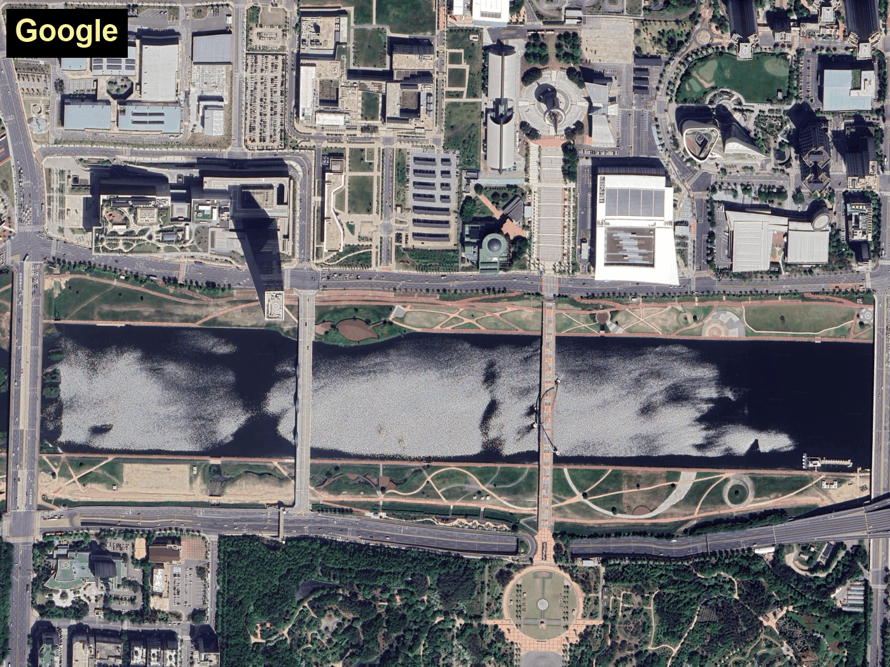</a></td>
    <td><a href="assets/01_urban_daejeon_00762211_4km.gif">4 km overview ↗</a></td>
  </tr>
  <tr>
    <td><b>02. Greenhouse plain, Gimje</b><br/>cloud-affected acquisition (scene 00880638)</td>
    <td><a href="assets/02_cloud_gimje_00880638_native.gif">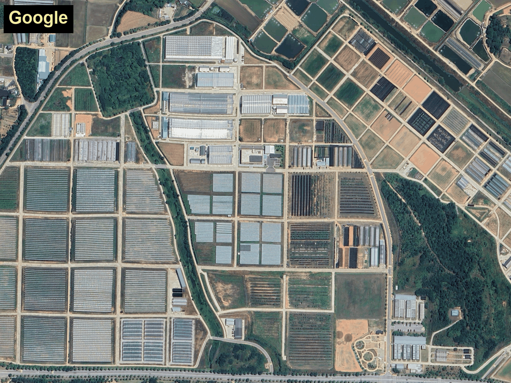</a></td>
    <td><a href="assets/02_cloud_gimje_00880638_4km.gif">4 km overview ↗</a></td>
  </tr>
  <tr>
    <td><b>03. Mountains, Daejeon</b><br/>forested terrain (scene 00762211)</td>
    <td><a href="assets/03_mountain_daejeon_00762211_native.gif">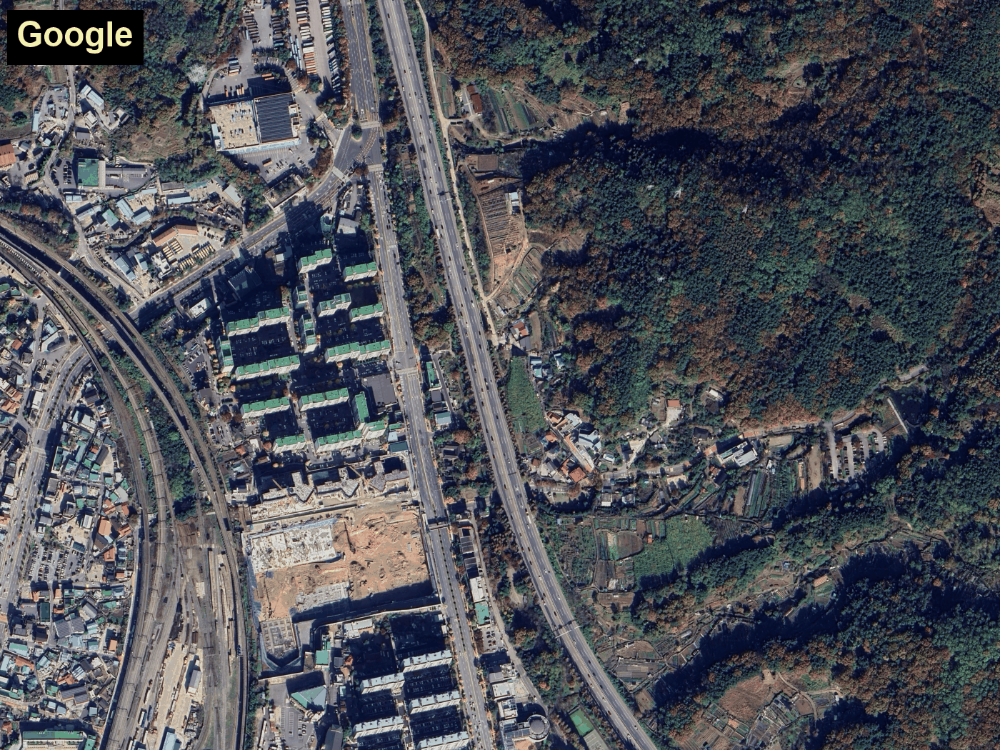</a></td>
    <td><a href="assets/03_mountain_daejeon_00762211_4km.gif">4 km overview ↗</a></td>
  </tr>
  <tr>
    <td><b>04. Restricted area, Daejeon</b><br/>military restricted zone (scene 00762211)</td>
    <td><a href="assets/04_restricted_daejeon_00762211_native.gif">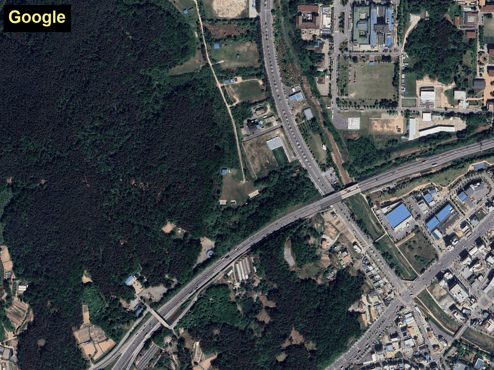</a></td>
    <td><a href="assets/04_restricted_daejeon_00762211_2km.gif">2 km overview ↗</a></td>
  </tr>
  <tr>
    <td><b>05. NGII comparison, Daejeon</b><br/>reference = NGII orthoimagery (scene 00762211)</td>
    <td><a href="assets/05_ngii_daejeon_00762211_native.gif">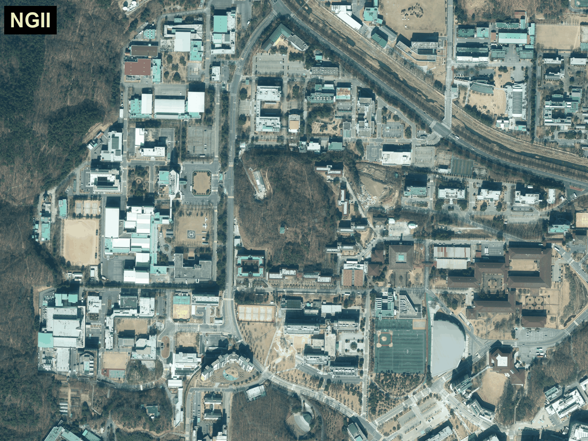</a></td>
    <td><a href="assets/05_ngii_daejeon_00762211_4km.gif">4 km overview ↗</a></td>
  </tr>
  <tr>
    <td><b>06. Steep mountains, Yeongdeok</b><br/>steep ridges and a river valley (scene 00116726)</td>
    <td><a href="assets/06_steep_mountain_yeongdeok_00116726_native.gif">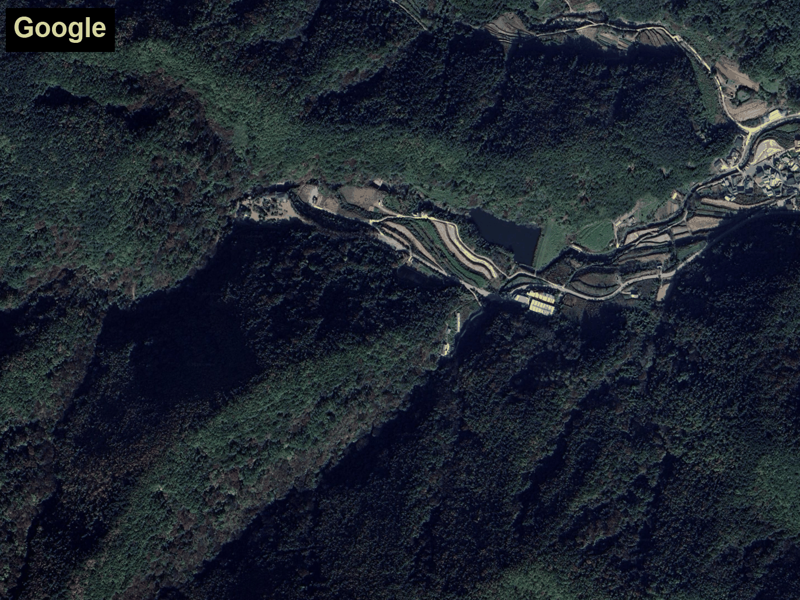</a></td>
    <td><a href="assets/06_steep_mountain_yeongdeok_00116726_4km.gif">4 km overview ↗</a></td>
  </tr>
  <tr>
    <td><b>07. River, Jinju</b><br/>river crossing the scene diagonally (scene 00290018)</td>
    <td><a href="assets/07_oblique_river_jinju_00290018_native.gif">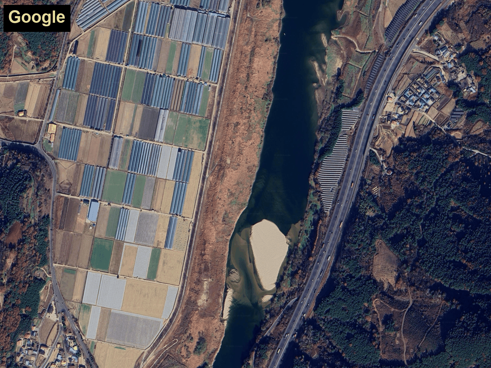</a></td>
    <td><a href="assets/07_oblique_river_jinju_00290018_4km.gif">4 km overview ↗</a></td>
  </tr>
  <tr>
    <td><b>08. Paddy plain, Gimje</b><br/>flat paddy fields (scene 00433561)</td>
    <td><a href="assets/08_paddy_plain_gimje_00433561_native.gif">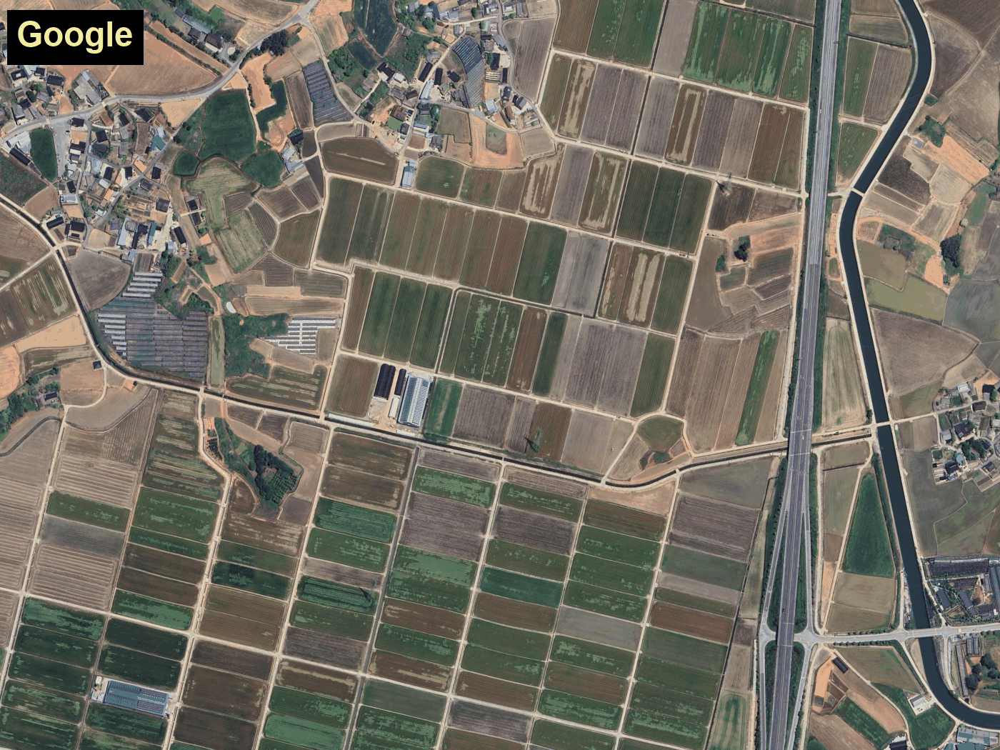</a></td>
    <td><a href="assets/08_paddy_plain_gimje_00433561_4km.gif">4 km overview ↗</a></td>
  </tr>
  <tr>
    <td><b>09. Estuary, Gunsan</b><br/>coastal bay and farmland (scene 00401233)</td>
    <td><a href="assets/09_estuary_gunsan_00401233_native.gif">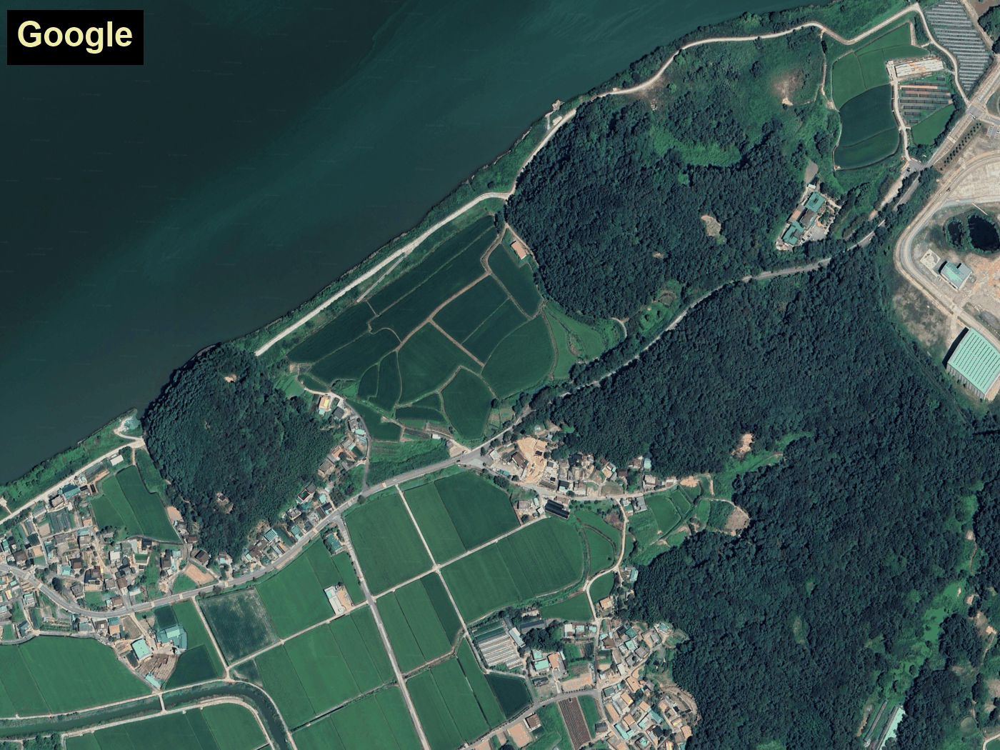</a></td>
    <td><a href="assets/09_estuary_gunsan_00401233_4km.gif">4 km overview ↗</a></td>
  </tr>
  <tr>
    <td><b>10. Urban, winter, Sejong</b><br/>urban blocks and highway (scene 00796455)</td>
    <td><a href="assets/10_urban_winter_sejong_00796455_native.gif">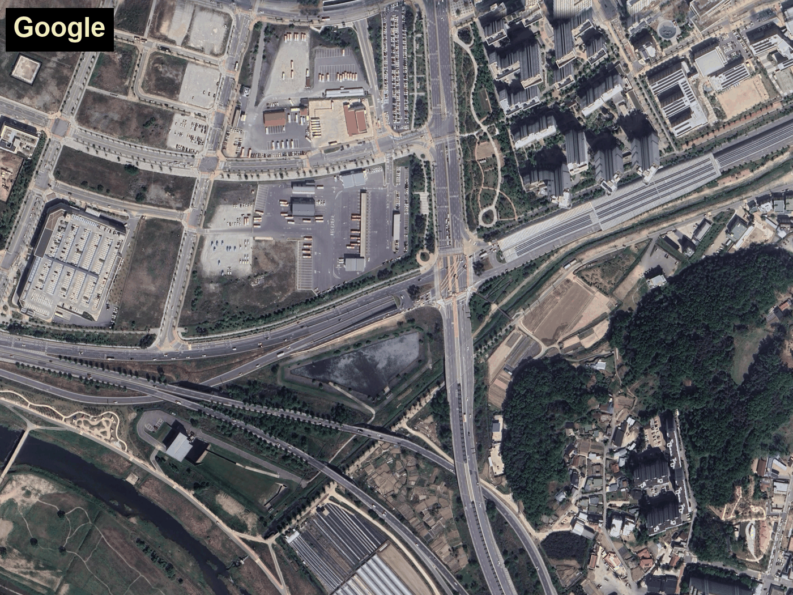</a></td>
    <td><a href="assets/10_urban_winter_sejong_00796455_4km.gif">4 km overview ↗</a></td>
  </tr>
  <tr>
    <td><b>11. Coast, East Sea</b><br/>harbor and breakwaters (scene 00024855)</td>
    <td><a href="assets/11_coast_east_sea_00024855_native.gif">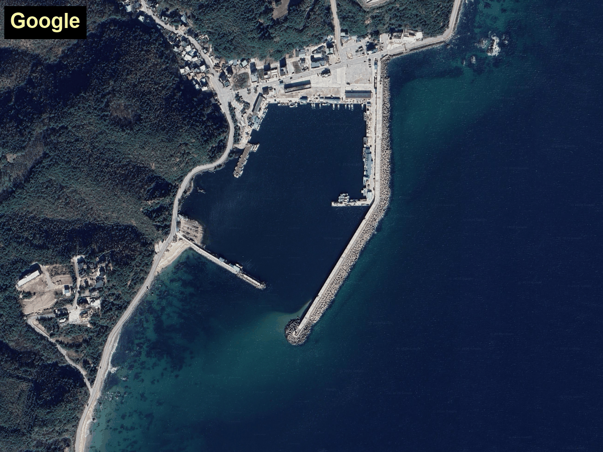</a></td>
    <td><a href="assets/11_coast_east_sea_00024855_4km.gif">4 km overview ↗</a></td>
  </tr>
</table>

## Check Point Collection

Registration accuracy was evaluated on independent check points (CPs) that were never used for model fitting. The CPs were collected by **10 operators** who viewed tiles of the initial RPC projection and of the reference image side by side and marked pairs of features identifiable in both images (road intersections, ground contacts of field boundaries and structures, etc.). Across the development and validation sets, the CP collection comprises **32,569 scene–CP pairs over 150 scenes**, with 200–932 CPs per scene (median 205).

The examples below show the manual CP marking: the reference tile and the initial RPC-projected tile are shown side by side with CP pairs marked in red.

<table>
  <tr>
    <td><a href="assets/checkpoint_1.jpg">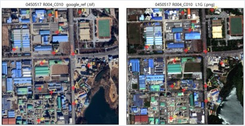</a></td>
    <td><a href="assets/checkpoint_2.jpg">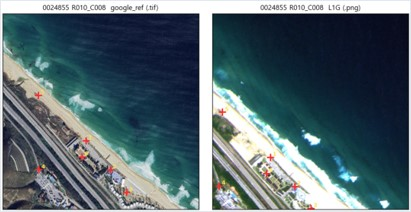</a></td>
  </tr>
  <tr>
    <td align="center">Urban area (Daejeon)</td>
    <td align="center">Coastal area</td>
  </tr>
  <tr>
    <td><a href="assets/checkpoint_3.jpg">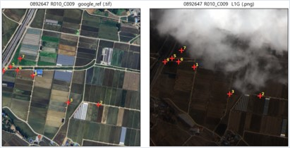</a></td>
    <td><a href="assets/checkpoint_4.jpg">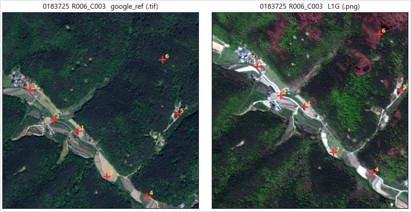</a></td>
  </tr>
  <tr>
    <td align="center">Agricultural fields</td>
    <td align="center">Mountainous forest</td>
  </tr>
</table>

Image credits: NEONSAT-1 imagery provided by KASA. Reference imagery: Imagery ©2025 Airbus, CNES/Airbus, Maxar Technologies; Map data ©2025 Google, as credited in the manuscript.

## Data Availability and Image Credits

This repository provides selected example images for qualitative inspection. The original NEONSAT-1 L1R products and RPCs, the full reference mosaic, and the underlying check-point and per-scene evaluation datasets are not provided here.

- **NEONSAT-1:** The original L1R images and RPCs were supplied for research purposes and are subject to the data owner's policy; requests for the original data should be directed to the provider.
- **Google reference imagery:** The study used a reference mosaic assembled from the Google satellite basemap. Image credits are given above the gallery and below the check-point examples. See [Google's Geo Guidelines](https://about.google/brand-resource-center/products-and-services/geo-guidelines/) for attribution and use requirements.
- **NGII reference imagery:** Example 05 uses national orthoimagery from the National Geographic Information Institute, Republic of Korea. Use of this imagery is subject to the source data's applicable terms.
- **Check points and evaluation data:** These are derived from restricted imagery and are not publicly available at present.

The example images retain the rights and use restrictions of their respective owners; their inclusion here does not grant permission to reuse the source imagery.

## Citation

Manuscript prepared for submission to the *IEEE Journal of Selected Topics in Applied Earth Observations and Remote Sensing*. The bibliographic entry below will be updated when publication details are available.

```bibtex
@misc{kim2026registration,
  author  = {Kim, Juyoung and Kim, Hyun-Ok and Oh, Han},
  title   = {Automated Registration of High-Resolution Satellite Imagery Using Height-Aware Global Modeling and Reliability-Controlled Local Refinement},
  year    = {2026},
  note    = {Manuscript prepared for submission to IEEE Journal of Selected Topics in Applied Earth Observations and Remote Sensing}
}
```

## Acknowledgments

This work was supported by the Korea government (Korea AeroSpace Administration, KASA) under Grant RS-2025-NR055937. The authors thank KASA for providing the NEONSAT-1 imagery.
